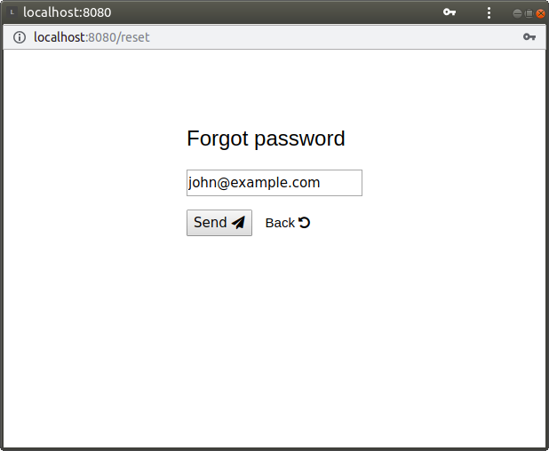

Server side application skeleton
===

Basic server side web application with the following functionality:
- HTTP/HTTPS servers
- routes and authentication on middleware (use [gorilla mux](https://github.com/gorilla/mux))
- session management (use [gorilla sessions](https://github.com/gorilla/sessions))
- user management (registration, change and delete user, password recovery by mail)
- offline fallback page if network fail
- modular design, can be extended very easy
- config file in JSON format
- database generated from file or model (with [Mysql Workbench](https://dev.mysql.com/downloads/workbench/))
- responsive interface for mobile access, browser back button disabled
- salted and hashed passwords in database

### Integrations

The skeleton is based on [W3CSS](https://www.w3schools.com/w3css/), a very lightweight CSS framework and is designed to integrate with [JQuery](https://jquery.com/), [Angular](https://angular.io/), [Fontawesome](https://fontawesome.com/v4.7.0/icons/) and some useful libraries like [Datetime picker](https://trentrichardson.com/examples/timepicker/) and [Google Charts](https://developers.google.com/chart/) (see `ui/head.html` file).

### Compilation modes

#### Plaint text passwords

	go build -tags="plain"

Passwords are stored in plain text in the database and sent as plain text on mail to recovery (unrecomanded).

#### Hashed passwords

	go build -tags="sha1 random"

Passwords are stored hashed in the database and sent as random on mail to recovery (recomanded).

#### Salted and hashed passwords

	go build -tags="saltsha1 random"

Passwords are stored salted and hashed in the database and sent as random on mail to recovery (highly recomanded).

The tag `random` mean send password as random string.

### How is look like?

#### Signup screen

#### Mail/reset my password

#### Signin screen

#### Basic home screen

#### Local account management

#### Network fail page

### Configuration file

	{
	    "database": {
	        "ip": "example.com",
	        "port": 3306,
	        "user": "root",
	        "password": "password",
	        "name": "skel"
	    },
	    "smtp": "smtp.gmail.com",
	    "port": 587,
	    "user": "mailer@gmail.com",
	    "password": "password",
	    "name": "mailer name"
	}

Database must be created by hand before running the program. Mailer is used to recovery forgotten passwords.

### Database

Database structure is described in `database.sql` file. Adjust the database name and import the file in Mysql. Alternatively you can use the model from `model/skel_full.mwb` (with [Mysql Workbench](https://dev.mysql.com/downloads/workbench/))

### Parameters

Start the program with the following parameters:

#### `-http`

Listening address and port for HTTP server. Default `:8080`.

#### `-https`

Listening address and port for HTTPS server. Default `:8090`.

#### `-https-enabled`

Enable HTTPS server. Default `false`.

### Adding a simple application

Add menu option in `ui/navbar.html` file

	<a href="/a/dummy" class="w3-bar-item" title="Dummy page">Page</i></a>

Add route to the application in `main.go` file

	application.HandleFunc("/dummy", dummy)

Create `ui/dummy.html` file for application user interface

	[[define "dummy"]]
	<!DOCTYPE html>
	<html lang="en">
	<head>
	<title></title>
	[[template "head"]]
	</head>
	<body>
	[[template "navbar" .]]
	

	  

	  <form method="post" action="">
	  <button type="submit" name="submit">Press this button!</button>
	  
[[.Message]]
	  </form>
	

	

	</body>
	</html>
	[[end]]

Create `ui_dummy.go` file who handle the application

	package main
	
	import (
		"net/http"
	)
	
	func dummy(w http.ResponseWriter, r *http.Request) {
		session, _ := store.Get(r, SESSID)
		user := session.Values["user"].(User)
		params := struct {
			Name    string // this is mandatory
			Message string // TODO add fields as you need
		}{Name: user.Name}
		switch r.Method {
		case "GET":
			templ.ExecuteTemplate(w, "dummy", params)
		case "POST":
			params.Message = "You pressed dummy button!"
			templ.ExecuteTemplate(w, "dummy", params)
		}
	}

Take care to the template parameters. Add them as you need. `Name` parameter must appear in all applications because is the user name from the top right navbar. 

Look carefully over **TODO** and **NOTE** comments because you may need to adjust as you need.

### Known issues

The skeleton is designed to work with HTML5 so make sure your browser support this.